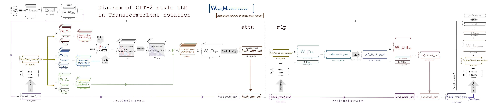

The old version used `HookedTransformer.from_pretrained`. Idea was in mapping all models to the one generalized construction HookedTransformer. But it's became too hard.  
New version uses `TransformerBridge.boot_transformers` - every model from HF stay the same, but with adapters it became friendly to transformer-lens abstractions/hooks/etc. Models - different, adapters - different, interface above adapter - the same.

If we need, we can create our own adapter.

MultiGPU support stay developed (when load model)

<b>TransformerLens 3.0 raises its minimum supported transformers to 5.4.0</b>

See https://transformerlensorg.github.io/TransformerLens/content/migrating_to_v3.html

## Patches for working with quantized versions of DeepseekV2 and Qwen3
I patched lib in some positions like TransformerLens/transformer_lens/model_bridge/generalized_components/position_embeddings_attention.py in places with `target_dtype = next(hf_attn.parameters()).dtype` and `hidden_states = hidden_states.to(dtype=target_dtype)` beacause it leads to cast to dtype of quantized(!) modules, that changed dtype for deepseek (bitsandbytes quant) to 4bit and changed dtype to torch.int32 for Qwen with gptqmodel quantization.

Also did it in TransformerLens/transformer_lens/model_bridge/generalized_components/moe.py

Need to build gptqmodel with #--no-build-isolation and "gptqmodel>=5.8.0,<6" for qwen and gptq (only! if no [tool.uv.extra-build-dependencies])

Also uv pip install --editable /glazkov-dev/TransformerLens --no-deps for patch TransformerLens

Please, use `uv sync --group=transformer_lens --no-build-isolation` if gptqmodel not in pyproject in [tool.uv.extra-build-dependencies]

For module usage and development: https://transformerlensorg.github.io/TransformerLens/content/model_structure.html